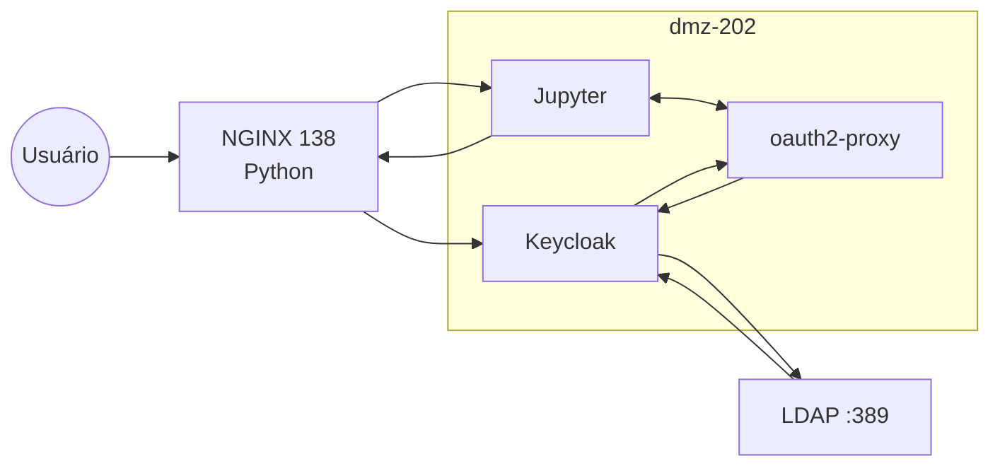

# JupyterLab protegido com OAuth2-Proxy + Keycloak (OIDC) + Redis

Este documento descreve a configuração completa para publicar o **JupyterLab** em subpath (`/jupyterlab_csc`) protegido por **oauth2-proxy**, autenticando via **Keycloak (OIDC)**, com **Redis** para armazenamento de sessão (evitando o limite de 4KB de cookies).

---

## Arquitetura resumida

* URL pública: `https://interno.empresa.com.br/jupyterlab_csc/`
* Reverse proxy: **NGINX** (host Windows)
* Containers (host Linux):

  * JupyterLab (`python:3.12-slim`)
  * oauth2-proxy (`v7.7.1`)
  * Redis (`7-alpine`)
* Identity Provider: **Keycloak**

  * Realm: `empresa`
  * Client: `jupyterlab-csc-hml`

---

## 1) Configuração do NGINX

Configuração responsável por:

* Normalizar callbacks OAuth fora do subpath
* Evitar loops de redirect
* Repassar corretamente o prefixo `/jupyterlab_csc`

Adicionar no `server` do domínio `interno.empresa.com.br`:

```nginx
	################################################
    # Configuração do fluxo oauth2 para jupyterlab #
    ################################################
	# Aceita cookies/headers grandes vindos do browser
    large_client_header_buffers 8 32k;

    # Aceita headers grandes vindos do upstream (Set-Cookie etc.)
    proxy_buffer_size 64k;
    proxy_buffers 16 64k;
    proxy_busy_buffers_size 128k;

    # (opcional) se você usa muitos redirects/cookies
    proxy_temp_file_write_size 128k;
	
	location = /oauth2/callback {
        return 301 /jupyterlab_csc/oauth2/callback$is_args$args;
    }
    location ^~ /oauth2/ {
        return 301 /jupyterlab_csc$request_uri;
    }
    location /jupyterlab_csc/ {
        proxy_pass http://empresa.empresa.com.br:22222;
        proxy_set_header Host $host;
        proxy_set_header X-Forwarded-Proto https;
        proxy_set_header X-Forwarded-Host $host;
        proxy_set_header X-Forwarded-Prefix /jupyterlab_csc;

        proxy_http_version 1.1;
        proxy_set_header Upgrade $http_upgrade;
        proxy_set_header Connection "upgrade";
        proxy_read_timeout 3600;
    }
```

---

## 2) Docker Compose completo (Jupyter + OAuth2-Proxy + Redis)

Arquivo `docker-compose.yml`:

```yaml
services:
  jupyter_csc:
    image: python:3.12.8-slim
    container_name: deepnote_jupyter_csc
    working_dir: /app
    volumes:
      - .:/app
    expose:
      - "8888"
    environment:
      PYTHONDONTWRITEBYTECODE: "1"
      PYTHONUNBUFFERED: "1"
    deploy:
      resources:
        limits:
          memory: 1048M
    command:
      - sh
      - -lc
      - |
          set -e
          pip install --no-cache-dir \
            deepnote-toolkit jupyterlab jupyterlab-deepnote \
            pandas openpyxl numpy fastapi uvicorn python-multipart
          exec jupyter lab \
            --ip=0.0.0.0 \
            --port=8888 \
            --no-browser \
            --allow-root \
            --ServerApp.token='' \
            --ServerApp.password='' \
            --ServerApp.trust_xheaders=True \
            --ServerApp.disable_check_xsrf=True \
            --ServerApp.allow_remote_access=True \
            --ServerApp.base_url='/jupyterlab_csc/'
    networks:
      - csc

  redis_csc:
    image: redis:7-alpine
    container_name: jupyter_oauth2_redis_csc
    command: ["redis-server", "--save", "", "--appendonly", "no"]
    expose:
      - "6379"
    networks:
      - csc

  oauth2-proxy:
    image: quay.io/oauth2-proxy/oauth2-proxy:v7.7.1
    container_name: jupyter_oauth2_proxy_csc
    depends_on:
      - jupyter_csc
      - redis_csc
    ports:
      - "0.0.0.0:22222:4180"
    environment:
      OAUTH2_PROXY_PROVIDER: keycloak-oidc
      OAUTH2_PROXY_OIDC_ISSUER_URL: https://auth-hml.empresa.com.br/auth/realms/empresa
      OAUTH2_PROXY_CLIENT_ID: jupyterlab-csc-hml
      OAUTH2_PROXY_CLIENT_SECRET: "<COPIAR_DO_KEYCLOAK>"

      OAUTH2_PROXY_COOKIE_SECRET: "<GERAR_SCRIPT_PY_ABAIXO>"
      OAUTH2_PROXY_COOKIE_SECURE: "true"
      OAUTH2_PROXY_COOKIE_DOMAIN: interno.empresa.com.br
      OAUTH2_PROXY_COOKIE_PATH: /jupyterlab_csc
      OAUTH2_PROXY_COOKIE_SAMESITE: "none"

      OAUTH2_PROXY_REVERSE_PROXY: "true"
      OAUTH2_PROXY_PROXY_PREFIX: /jupyterlab_csc/oauth2
      OAUTH2_PROXY_REDIRECT_URL: https://interno.empresa.com.br/jupyterlab_csc/oauth2/callback

      OAUTH2_PROXY_UPSTREAMS: http://deepnote_jupyter_csc:8888/jupyterlab_csc/

      OAUTH2_PROXY_EMAIL_DOMAINS: "*"
      OAUTH2_PROXY_HTTP_ADDRESS: 0.0.0.0:4180

      OAUTH2_PROXY_PASS_ACCESS_TOKEN: "true"
      OAUTH2_PROXY_SET_AUTHORIZATION_HEADER: "true"
      OAUTH2_PROXY_SET_XAUTHREQUEST: "true"

      OAUTH2_PROXY_PROVIDER_CA_FILE: /etc/ssl/certs/ca-certificates.crt
      OAUTH2_PROXY_HTTP_CLIENT_TIMEOUT: 30s
      OAUTH2_PROXY_SKIP_PROVIDER_BUTTON: "true"

      # Redis (evita limite de 4KB em cookies)
      OAUTH2_PROXY_SESSION_STORE_TYPE: redis
      OAUTH2_PROXY_REDIS_CONNECTION_URL: redis://jupyter_oauth2_redis_csc:6379

      # Ajustes necessários para Keycloak
      OAUTH2_PROXY_INSECURE_OIDC_ALLOW_UNVERIFIED_EMAIL: "true"
      OAUTH2_PROXY_OIDC_EXTRA_AUDIENCE: account
      OAUTH2_PROXY_CODE_CHALLENGE_METHOD: S256

      OAUTH2_PROXY_ALLOWED_GROUPS: jupyterlab_csc
    networks:
      - csc

networks:
  csc:
    external: true
```

---

## 3) Como gerar o `OAUTH2_PROXY_COOKIE_SECRET`

O cookie secret **deve ser base64** e forte o suficiente para criptografar cookies de sessão.

### Opção recomendada (Linux / macOS)

```bash
python3 - <<'PY'
import os, base64
print(base64.urlsafe_b64encode(os.urandom(32)).decode())
PY
```

Copie o valor gerado e use em:

```yaml
OAUTH2_PROXY_COOKIE_SECRET: "<SECRET_AQUI>"
```

> ⚠️ Trocar esse valor invalida todas as sessões existentes.

---

## 4) Keycloak – Client Scope (Audience Mapper)

### Objetivo

Garantir que o token contenha:

```json
"aud": ["jupyterlab-csc-hml"]
```

tanto no **ID Token** quanto no **Access Token**.

---

### 4.1 Criar Client Scope

1. Acesse **Client scopes**
2. Clique em **Create client scope**
3. Preencha:

   * **Name**: `audience-jupyterlab-csc`
   * **Type**: `Default`
4. Salve

---

### 4.2 Criar Audience Mapper

1. Dentro do client scope `audience-jupyterlab`, vá em **Mappers**
2. Clique em **Add mapper**
3. Selecione **Audience**
4. Configure:

* **Name**: `audience-jupyterlab-csc-hml`
* **Included Client Audience**: **`jupyterlab-csc-hml`** (obrigatório selecionar no dropdown)
* **Included Custom Audience**: (vazio)
* **Add to ID token**: **ON**
* **Add to access token**: **ON**
* **Add to token introspection**: **ON**

5. Clique em **Save**

---

### 4.3 Associar o Client Scope ao client

1. Vá em **Clients → jupyterlab-csc-hml**
2. Aba **Client scopes**
3. Clique em **Add client scope**
4. Selecione `audience-jupyterlab-csc`
5. Em **Assigned type**, escolha **Default**
6. Salve

---

### 4.4 Validação

Após salvar tudo:

1. Faça logout completo
2. Autentique novamente
3. Decode o token JWT
4. Confirme:

```json
"aud": ["jupyterlab-csc-hml"]
```

---

## 5) Observações importantes

* Redis é obrigatório para evitar erro de cookies grandes
* Loop de redirect geralmente indica:

  * Callback fora de `/jupyterlab_csc/oauth2/callback`
  * NGINX sem o redirecionamento `/oauth2/* → /jupyterlab_csc/oauth2/*`
* Sempre que alterar Keycloak:

  * Limpar cookies
  * Refazer login

---

## 6) Resultado esperado

Ao acessar:

```
https://interno.empresa.com.br/jupyterlab_csc/
```

Fluxo correto:

1. Redireciona para Keycloak
2. Usuário autentica
3. Callback em `/jupyterlab_csc/oauth2/callback`
4. Sessão criada no Redis
5. JupyterLab carregado com sucesso

### Exemplo para teste: Ler Planilha com 2 Colunas com valores inteiros no JupyterLab

```
import pandas as pd

# O parâmetro header=None diz que a planilha NÃO tem títulos nas colunas
# O parâmetro names=['A', 'B'] dá nome às colunas para o código funcionar
df = pd.read_excel('dados.xlsx', header=None, names=['A', 'B'])

# Agora o restante do seu loop deve funcionar perfeitamente:
df['Multiplicacao'] = 0.0

for i in df.index:
    valor_a = df.loc[i, 'A']
    valor_b = df.loc[i, 'B']
    resultado = valor_a * valor_b
    df.at[i, 'Multiplicacao'] = resultado

display(df)
```


## Diagrama da Arquitetura



# Controle de Acesso ao JupyterLab csc EMPRESA com Keycloak + LDAP

## Esta seção descreve o passo a passo para controlar o acesso ao ambiente **JupyterLab da área CSC** utilizando:

- Keycloak
- Autenticação via LDAP
- Autorização por **grupos**
- oauth2-proxy como camada de proteção

O objetivo é garantir que **apenas usuários pertencentes ao grupo `jupyterlab_csc`** tenham acesso ao client **`jupyterlab-csc-hml`**.

---

## Visão Geral da Estratégia

- ✔ Um **client por área** no Keycloak (`jupyterlab-csc-hml`)
- ✔ Um **grupo por área** (`jupyterlab_csc`)
- ✔ Usuários continuam sendo autenticados via **LDAP**
- ✔ Autorização baseada em **groups no token**
- ✔ oauth2-proxy restringe acesso pelo grupo

---

## 1️⃣ Criar o grupo da área csc no Keycloak

### Caminho

Keycloak Admin
→ Realm: empresa
→ Groups
→ Create group


### Configuração
- **Name:** `jupyterlab_csc`
- **Description (opcional):** Acesso ao JupyterLab da área CSC

Clique em **Create**.

---

## 3️⃣ Incluir o usuário LDAP no grupo CSC

> ⚠️ Usuários LDAP **não são criados manualmente** no Keycloak.  
> Eles aparecem automaticamente após o primeiro login ou sincronização.

### Caminho
Users
→ Buscar usuário (ex: meu.login)
→ Groups
→ Join Group


### Ação
- Selecione o grupo **`jupyterlab_csc`**
- Clique em **Join**

A partir deste ponto, o usuário passa a herdar esse grupo nos tokens.

---

## 4️⃣ Criar um Client Scope para expor grupos no token (se ainda não existir)

O oauth2-proxy precisa que os grupos estejam presentes no token JWT.

### Caminho
Client Scopes
→ Create client scope


### Configuração
- **Name:** `groups`
- **Protocol:** OpenID Connect
- **Type:** Default

Clique em **Create**.

---

## 4.1️⃣ Criar mapper de grupos

Dentro do client scope `groups`:

### Caminho
Client Scopes
→ groups
→ Mappers
→ Add mapper
→ By configuration
→ Group Membership


### Configuração do Mapper
- **Name:** `groups`
- **Token Claim Name:** `groups`
- **Full group path:** Off
- **Add to ID token:** ✅ ON
- **Add to access token:** ✅ ON
- **Add to userinfo:** opcional

Clique em **Save**.

---

## 5️⃣ Associar o Client Scope `groups` ao client CSC

### Caminho
Clients
→ jupyterlab-csc-hml
→ Client scopes


### Ação
- Adicionar o client scope **`groups`**
- Marcar como **Default**

Isso garante que o token emitido para o client contenha a claim `groups`.

---

## 6️⃣ Validar o token (muito importante)

Após autenticar, valide o **access token** (via logs do oauth2-proxy ou https://jwt.io).

### Exemplo esperado de token:
```json
{
  "preferred_username": "meu.login",
  "groups": [
    "jupyterlab_csc"
  ],
  "aud": [
    "jupyterlab-csc-hml",
    "account"
  ]
}
```

## 7️⃣ Restringir acesso no oauth2-proxy por grupo

No docker-compose.yml do ambiente CSC, adicione a variável:

```
OAUTH2_PROXY_ALLOWED_GROUPS: jupyterlab_csc
```
